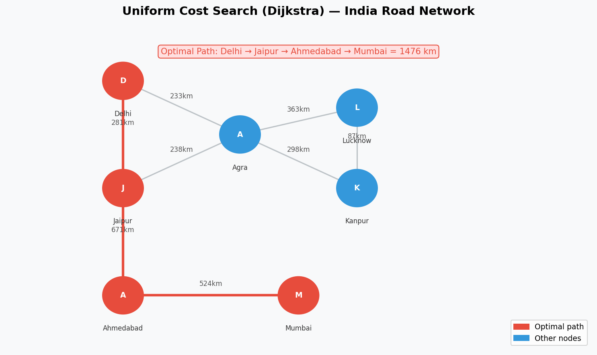
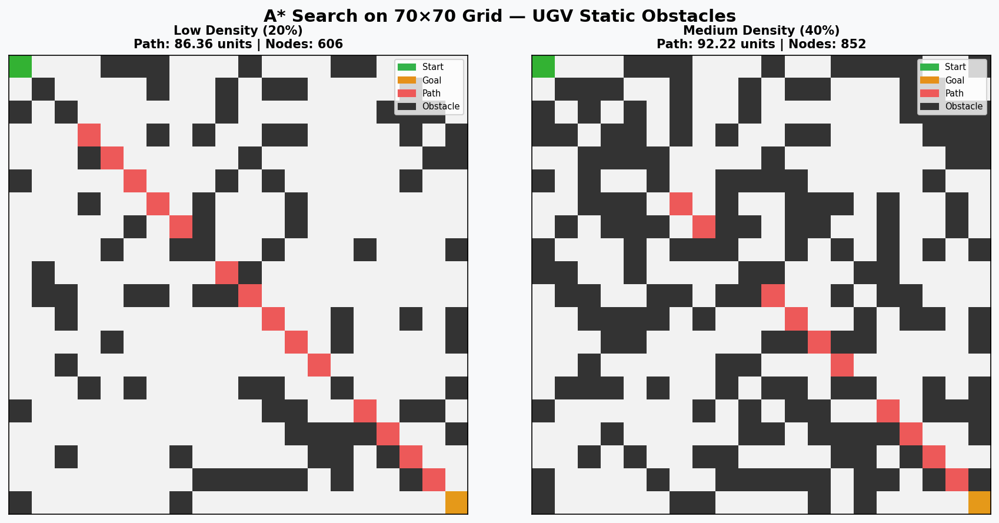
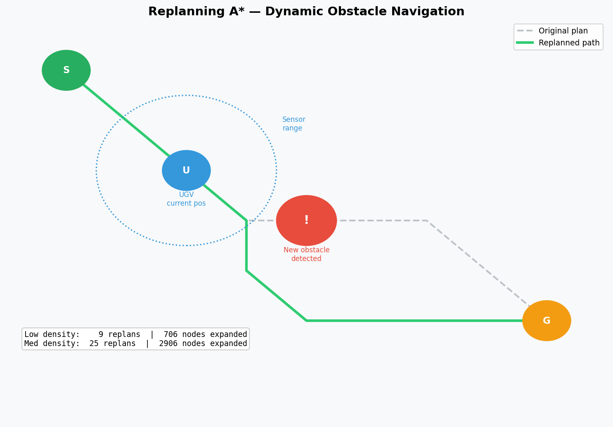

# AI Assignment 3 — Search Algorithms

**Subject:** Artificial Intelligence
**Reference:** Russell & Norvig — *Artificial Intelligence: A Modern Approach (AIMA, 4th Ed.)*

---

## Table of Contents
1. [Project Structure](#project-structure)
2. [Part 1 — Dijkstra / Uniform Cost Search](#part-1--dijkstra--uniform-cost-search)
3. [Part 2 — UGV Navigation with Static Obstacles](#part-2--ugv-navigation-with-static-obstacles)
4. [Part 3 — UGV Navigation with Dynamic Obstacles](#part-3--ugv-navigation-with-dynamic-obstacles)
5. [How to Run](#how-to-run)
6. [References](#references)

---

## Project Structure
```
AI_Assignment_3/
│
├── README.md
├── requirements.txt
│
├── images/
│   ├── dijkstra_example.png    # UCS/Dijkstra graph visualization
│   ├── astar_grid.png          # A* grid pathfinding diagram
│   └── dynamic_replanning.png  # Dynamic obstacle replanning diagram
│
├── Dijkstra/
│   ├── india_cities.py         # Road graph of 50+ Indian cities
│   ├── ucs_dijkstra.py         # Uniform Cost Search implementation
│   └── web_demo/
│       ├── App.jsx             # React interactive visualization (bonus)
│       └── README.md           # Web demo instructions
│
├── UGV_Static/
│   ├── grid_map.py             # 70x70 grid generator (3 density levels)
│   ├── astar.py                # A* search implementation
│   └── ugv_static.py           # Main runner with performance metrics
│
└── UGV_Dynamic/
    ├── dynamic_grid.py         # Grid with dynamic obstacle generation
    ├── replan_astar.py         # Replanning A* (simplified D* Lite)
    └── ugv_dynamic.py          # Main runner with performance metrics
```

--- 

## Part 1 — Dijkstra / Uniform Cost Search

### What is Uniform Cost Search?

When actions have different costs, the best strategy is to expand the node
with the **lowest path cost g(n)**. This is called:

- **Dijkstra's Algorithm** — by the computer science community
- **Uniform Cost Search (UCS)** — by the AI community

> UCS is a special case of Best-First Search where **f(n) = g(n)**
> — AIMA Chapter 3

### Algorithm
```
1. Initialize frontier = priority queue with (cost=0, start_city)
2. Pop node with lowest path cost g(n)
3. If node == goal → return path
4. Mark node as explored
5. For each neighbour:
      new_cost = current_cost + edge_cost
      if not explored → push to frontier
6. Repeat until goal found or frontier empty
```

### Properties

| Property | Value |
|----------|-------|
| Complete | Yes |
| Optimal | Yes — always finds lowest cost path |
| Time Complexity | O(b^(1 + C*/ε)) |
| Space Complexity | O(b^(1 + C*/ε)) |

### Uniform Cost Search Visualization



### India Road Network

Graph contains **50+ major Indian cities** with real approximate road distances.

| Region | Cities |
|--------|--------|
| North | Delhi, Chandigarh, Amritsar, Jammu, Srinagar, Shimla |
| East | Kolkata, Patna, Gaya, Ranchi, Bhubaneswar, Guwahati |
| West | Mumbai, Ahmedabad, Pune, Surat, Vadodara, Goa |
| South | Chennai, Bangalore, Hyderabad, Kochi, Trivandrum, Madurai |
| Central | Bhopal, Indore, Nagpur, Jabalpur, Raipur |
| Rajasthan | Jaipur, Jodhpur, Udaipur, Ajmer |
| UP | Lucknow, Agra, Varanasi, Allahabad, Kanpur |

### Results

| Route | Shortest Path | Distance | Nodes Expanded |
|-------|--------------|----------|----------------|
| Delhi → Mumbai | Delhi → Jaipur → Ahmedabad → Mumbai | 1476 km | 36 |
| Chennai → Delhi | Chennai → Hyderabad → ... → Agra → Delhi | 2101 km | 33 |
| Amritsar → Trivandrum | Amritsar → Delhi → ... → Madurai → Trivandrum | 3233 km | 53 |
| Jaipur → Kolkata | Jaipur → Agra → ... → Gaya → Kolkata | 1594 km | 39 |
| Mumbai → Guwahati | Mumbai → Nagpur → ... → Siliguri → Guwahati | 2910 km | 53 |

---

## Part 2 — UGV Navigation with Static Obstacles

### Problem

An Unmanned Ground Vehicle (UGV) must find the optimal path from a
user-specified start node to a goal node on a **70×70 grid battlefield**.
Obstacles are known **a-priori** (static environment).

### Algorithm: A* Search (Informed Search)

A* uses **f(n) = g(n) + h(n)** where:

| Symbol | Meaning |
|--------|---------|
| g(n) | Actual cost from start to current node |
| h(n) | Heuristic estimate from current node to goal |
| f(n) | Total estimated path cost |

**Heuristic (Euclidean Distance):**
```
h(n) = √((x_goal − x)² + (y_goal − y)²)
```

This heuristic is **admissible** — it never overestimates the true cost,
guaranteeing the optimal path.

### Obstacle Density Levels

| Level | Obstacle % | Path Found | Path Length | Nodes Expanded | Time |
|-------|-----------|------------|-------------|----------------|------|
| Low | 20% | Yes | 86.36 units | 606 | 8.9ms |
| Medium | 40% | Yes | 92.22 units | 852 | 8.3ms |
| High | 60% | No | N/A | 29 | 0.17ms |

### A* Pathfinding on Grid



> **Note:** Diagram shows Low (20%) and Medium (40%) density cases where path was found.
> High density (60%) case is not shown — at 60% obstacle coverage the grid becomes disconnected and no path exists from start to goal.

### Key Observations
- Higher obstacle density forces the algorithm to take longer detours
- The number of expanded nodes increases as the environment becomes more constrained
- At very high densities (≈60%) the grid may become disconnected, making the goal unreachable
- A* expands far fewer nodes than uninformed search (BFS/DFS) due to heuristic guidance
- Movement is 8-directional — diagonal moves cost √2 ≈ 1.414

---

## Part 3 — UGV Navigation with Dynamic Obstacles

### Problem

In real battlefield environments, obstacles are **not all known a-priori**
and can appear or change during navigation. The UGV must detect and respond
to new obstacles in real time.

### Algorithm: Replanning A* (Simplified D* Lite)

Strategy:
1. Plan initial path using A* on known grid (unknown cells treated as free)
2. Move step by step along planned path
3. Sense environment within **5-cell sensor range** after each step
4. If newly discovered obstacle blocks remaining path → **REPLAN** from current position
5. Repeat until goal reached or truly unreachable

> Reference: AIMA Chapter 4 — Search in Partially Observable Environments

### Key Difference from Static UGV

| Feature | Static (Part 2) | Dynamic (Part 3) |
|---------|----------------|------------------|
| Obstacles known | All a-priori | Discovered during navigation |
| Algorithm | A* (one plan) | Replanning A* |
| Replans | 0 | Multiple |
| Environment | Fully observable | Partially observable |

### Results

| Density | Found | Steps | Path Length | Replans | Nodes Expanded | Time |
|---------|-------|-------|-------------|---------|----------------|------|
| Low 20% | Yes | 65 | 86.94 units | 9 | 706 | 10.99ms |
| Medium 40% | Yes | 74 | 93.04 units | 25 | 2906 | 22.48ms |
| High 60% | No | — | — | — | — | — |

### Dynamic Obstacle Replanning



> **Note:** High density (60%) case not shown — initial path could not be found due to disconnected grid.

### Key Observations
- More obstacles → more replans → more nodes expanded → higher time
- Medium density triggers 25 replans vs only 9 for low density
- At very high densities (≈60%) the grid may be disconnected from the start
- Unknown cells are treated optimistically as free during planning
- Sensor range of 5 cells gives UGV local awareness without global knowledge

### How to Run
```bash
cd UGV_Dynamic
python3 ugv_dynamic.py demo     # all 3 density levels
python3 ugv_dynamic.py          # interactive mode
```

### Files
- `UGV_Dynamic/dynamic_grid.py` — grid with dynamic obstacle generation and sensor model
- `UGV_Dynamic/replan_astar.py` — replanning A* implementation
- `UGV_Dynamic/ugv_dynamic.py` — main runner with performance metrics

---

## How to Run

### Install dependencies
```bash
pip install -r requirements.txt
```

### Part 1 — Dijkstra / UCS
```bash
cd Dijkstra
python3 ucs_dijkstra.py demo          # 6 preset routes
python3 ucs_dijkstra.py               # interactive mode
python3 ucs_dijkstra.py Delhi Mumbai  # direct query

> **Bonus:** An interactive React web demo is available in `Dijkstra/web_demo/` — paste `App.jsx` into [codesandbox.io](https://codesandbox.io) for instant browser visualization.
```

### Part 2 — UGV Static Obstacles
```bash
cd UGV_Static
python3 ugv_static.py demo            # all 3 density levels
python3 ugv_static.py                 # interactive mode
```

### Part 3 — UGV Dynamic Obstacles
```bash
cd UGV_Dynamic
python3 ugv_dynamic.py demo           # all 3 density levels
```

---

## References

1. Russell, S., & Norvig, P. (2021). *Artificial Intelligence: A Modern Approach* (4th Edition). Pearson.
2. Road distances sourced from open map data (approximate values).
3. Hart, P., Nilsson, N., Raphael, B. (1968). *A Formal Basis for the Heuristic Determination of Minimum Cost Paths.* IEEE Transactions on Systems Science and Cybernetics.
